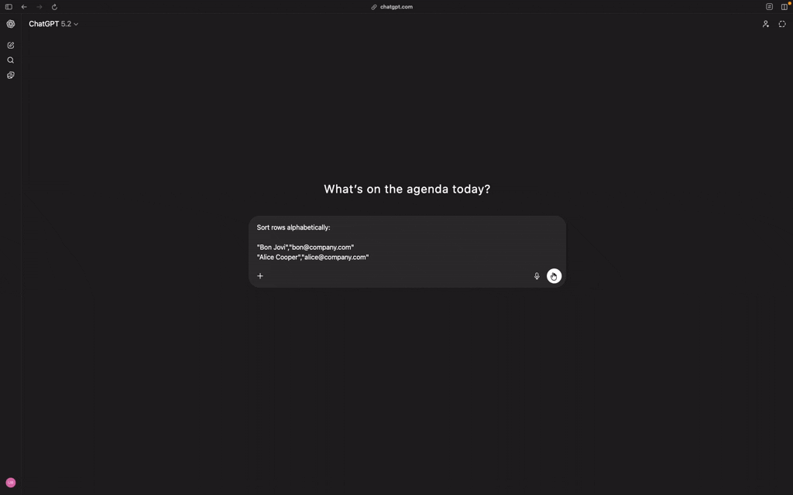

⚠️ Experimental: use at your own risk. Behavior and APIs may change without notice.

# PromptShield

PromptShield is a local HTTP/HTTPS proxy with MITM support for AI traffic. It helps prevent sensitive data from leaving your machine by detecting and masking PII or secrets before requests reach AI providers. It also restores original values in responses so your tools keep working as expected.

> 🔒 **100% Local Processing**: All detection, masking, and restoration happens entirely on your machine. Nothing is sent to external services for analysis or logging.

## Problem

Developers and teams increasingly send prompts, logs, code, and customer data to AI tools. In many setups, there is no local protection layer between apps and external AI APIs. That gap can lead to accidental data leaks, compliance issues, and loss of control over what is shared.

## Solution

PromptShield runs locally as a proxy between your app and the AI provider. It can inspect outbound payloads, detect sensitive values, replace them with placeholders, and forward only sanitized content upstream. When the response comes back, PromptShield restores placeholders to original values for a seamless developer experience and can send local notifications about privacy-relevant activity.

```text
App → PromptShield → AI provider
```

## Features

- PII detection for common sensitive fields (email, phone, names, etc.)
- Current PII detection relies on local regex-based detectors only
- Request masking with deterministic placeholders (for example: `[EMAIL_1]`)
- Response restore to preserve downstream app behavior
- macOS system notifications for key proxy/sanitization events
- Streaming-safe behavior (does not break streaming flows)
- System proxy integration for quick machine-wide routing
- Performance instrumentation for sanitize, upstream, and total latency

## Demo



## How it works

1. **Intercept request** from your app via local HTTP/HTTPS proxy.
2. **Detect sensitive data** using configured rules.
3. **Mask detected values** with placeholders.
4. **Send sanitized request upstream** to the AI provider.
5. **Restore original values in the response** where applicable.
6. **Notify locally** (macOS) when important events occur.

Example transformation:

```text
alice@company.com → [EMAIL_1]
```

## Quick Start

### 1) Clone

```bash
git clone https://github.com/ubcent/prompt-shield.git
cd prompt-shield
```

### 2) Build

```bash
make build
```

### 3) Generate local CA certificate

MITM mode requires a local CA certificate.

```bash
./psctl ca init
```

### 4) Install certificate in your system trust store (macOS)

```bash
open ~/.promptshield/ca/cert.pem
```

Then in **Keychain Access**:

1. Add the certificate to the login keychain
2. Open certificate trust settings
3. Set **When using this certificate** to **Always Trust**

### 5) Start PromptShield

```bash
./psctl start
```

### 6) Enable system proxy

```bash
./psctl proxy on
```

### 7) Test with curl

```bash
curl -x http://localhost:8080 https://api.openai.com/v1/chat/completions \
  -H "Content-Type: application/json" \
  -H "Authorization: Bearer $OPENAI_API_KEY" \
  -d '{
    "model": "gpt-4o-mini",
    "messages": [
      {"role":"user","content":"Contact me at alice@company.com"}
    ]
  }'
```

## Example

Request sent by your app:

```json
{
  "messages": [
    {"role": "user", "content": "Contact me at alice@company.com"}
  ]
}
```

Behavior:

- PromptShield detects `alice@company.com`
- It sends `[EMAIL_1]` upstream instead of raw email
- It restores original values in response content when mapped
- It emits a local notification if notifications are enabled

## Configuration

Example `config.yaml`:

```yaml
port: 8080
log_file: ~/.promptshield/audit.log
mitm:
  enabled: true
  domains:
    - api.openai.com
    - chatgpt.com
sanitizer:
  enabled: true
  types:
    - email
  confidence_threshold: 0.8
  max_replacements: 10
notifications:
  enabled: true
rules:
  - id: mitm-openai
    match:
      host_contains: openai.com
    action: mitm
  - id: mitm-chatgpt
    match:
      host_contains: chatgpt.com
    action: mitm
  - id: allow-all
    action: allow
```

## Performance

PromptShield is designed to keep overhead low:

- sanitizer stage is typically fast (~1–2ms for common payloads)
- proxy overhead is minimal in local environments
- most end-to-end latency usually comes from upstream AI providers

## Limitations

- Streaming responses are forwarded but not content-modified
- Current sanitization focuses on text payloads
- PII detection is regex-based today; higher-accuracy detection is planned
- Notifications are currently focused on macOS

## Roadmap

- broader secret detection coverage
- integrate Microsoft Presidio for advanced PII detection
- stricter blocking mode with policy controls
- extensible policy engine
- local dashboard for visibility and debugging

## Vision

PromptShield aims to be the default privacy layer between developers and AI systems. The long-term goal is simple: make safe AI usage the path of least resistance.

## Contributing

Contributions are welcome. Please open an issue to discuss major changes, and submit a PR with clear scope, tests (when applicable), and updated documentation.

## License

MIT
